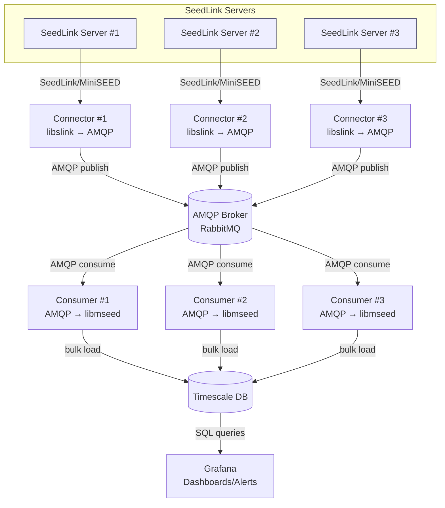

# seisstream

Simple C utilities for streaming MiniSEED over AMQP and ingesting into TimescaleDB.

## Architecture



## Components
- `connector/`: SeedLink client that forwards packets to an AMQP (RabbitMQ) broker.
- `consumer/`: AMQP consumer that parses MiniSEED (libmseed) and bulk-loads samples into TimescaleDB.

## Build
Prerequisites: `libslink`, `librabbitmq`, `libmseed`, `libpq` headers/libs available to the compiler.

```sh
make            # builds connector and consumer into ./build
make connector  # builds only connector
make consumer   # builds only consumer
```

## Connector usage (SeedLink → AMQP)
```sh
./build/connector [options] host[:port]
  -V                 report version
  -h                 show help
  -v                 increase verbosity (repeatable)
  -p                 print packet details
  -Ap                prompt for SeedLink user/password
  -At                prompt for SeedLink token
  -nd <secs>         reconnect delay (default 30)
  -nt <secs>         idle timeout (default 600)
  -k <secs>          keepalive interval
  -l <listfile>      stream list file (multi-station)
  -s <selectors>     selectors for all-station/default
  -S <streams>       NET_STA[:selectors], comma-separated
  -x <statefile>     save/restore sequence state
  --amqp-host host   AMQP host (default 127.0.0.1)
  --amqp-port port   AMQP port (default 5672)
  --amqp-user user   AMQP user (default guest)
  --amqp-password pw AMQP password (default guest)
  --amqp-vhost vhost AMQP vhost (default /)
  --amqp-exchange ex AMQP exchange (default empty)
  --amqp-routing-key k AMQP routing key/queue (default binq)
```
## Consumer usage (AMQP → TimescaleDB)
```sh
./build/consumer [opts]
  -h <amqp-host>      (default 127.0.0.1)
  -p <amqp-port>      (default 5672)
  -u <amqp-user>      (default guest)
  -P <amqp-pass>      (default guest)
  -v <amqp-vhost>     (default /)
  -q <queue>          (default binq)
  --prefetch <n>      (default 10)
  --verbose           (libmseed verbose parsing)
  --pg-host <host>    (default 192.168.0.106)
  --pg-port <port>    (default 5432)
  --pg-user <user>    (default admin)
  --pg-password <pw>  (default my-secret-pw)
  --pg-db <name>      (default seismic)
```
