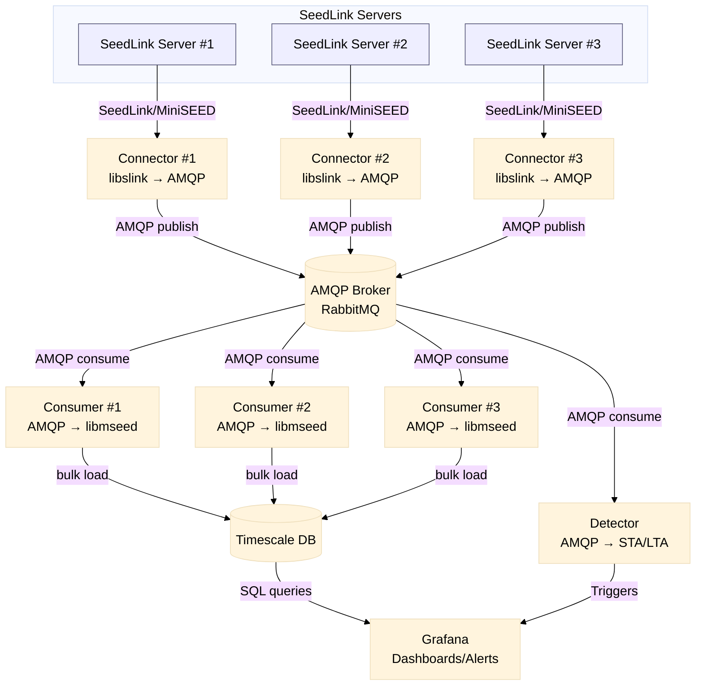

# seisstream

Simple C utilities for streaming MiniSEED over AMQP and ingesting into TimescaleDB.

## Architecture



## Components
- `connector/`: SeedLink client that forwards packets to an AMQP (RabbitMQ) broker.
- `consumer/`: AMQP consumer that parses MiniSEED (libmseed) and bulk-loads samples into TimescaleDB.
- `detector/`: Python AMQP consumer that decodes miniSEED with `pymseed`, keeps a rolling in-memory buffer per source id, and calls a (user-implemented) STA/LTA detector hook.

## Build
Prerequisites: `libslink`, `librabbitmq`, `libmseed`, `libpq` headers/libs available to the compiler.

```sh
make            # builds connector and consumer into ./build
make connector  # builds only connector
make consumer   # builds only consumer
```

Python detector prerequisites: `pika`, `pymseed`, `numpy` (available in the current dev environment). Run with `python3 detector/main.py ...`.

## Docker
```sh
# Build the connector-only image
docker build --target connector -t seisstream-connector .
# Build the consumer-only image
docker build --target consumer -t seisstream-consumer .

docker run --rm -v $(pwd)/streamlist.conf:/app/streamlist.conf:ro \
  seisstream-connector --amqp-host rabbitmq.example --amqp-user user --amqp-password secret host:18000
# Consumer example
docker run --rm seisstream-consumer --pg-host db --pg-user admin --pg-password my-secret-pw
```

## Connector usage (SeedLink → AMQP)
```sh
./build/connector [options] host[:port]
  -V                 report version
  -h                 show help
  -v                 increase verbosity (repeatable)
  -p                 print packet details
  -Ap                prompt for SeedLink user/password
  -At                prompt for SeedLink token
  -nd <secs>         reconnect delay (default 30)
  -nt <secs>         idle timeout (default 600)
  -k <secs>          keepalive interval
  -l <listfile>      stream list file (multi-station)
  -s <selectors>     selectors for all-station/default
  -S <streams>       NET_STA[:selectors], comma-separated
  -x <statefile>     save/restore sequence state
  --amqp-host host   AMQP host (default 127.0.0.1)
  --amqp-port port   AMQP port (default 5672)
  --amqp-user user   AMQP user (default guest)
  --amqp-password pw AMQP password (default guest)
  --amqp-vhost vhost AMQP vhost (default /)
  --amqp-exchange ex AMQP exchange (default empty)
  --amqp-routing-key k AMQP routing key/queue (default binq)
```

## Consumer usage (AMQP → TimescaleDB)
```sh
./build/consumer [opts]
  -h <amqp-host>      (default 127.0.0.1)
  -p <amqp-port>      (default 5672)
  -u <amqp-user>      (default guest)
  -P <amqp-pass>      (default guest)
  -v <amqp-vhost>     (default /)
  -q <queue>          (default binq)
  --prefetch <n>      (default 10)
  --verbose           (libmseed verbose parsing)
  --pg-host <host>    (default 192.168.0.106)
  --pg-port <port>    (default 5432)
  --pg-user <user>    (default admin)
  --pg-password <pw>  (default my-secret-pw)
  --pg-db <name>      (default seismic)
```

## Detector usage (AMQP → in-memory STA/LTA)
The detector consumes miniSEED from AMQP, decodes to NumPy, maintains a bounded buffer per source id, and invokes `detect_sta_lta(...)` (stub you can fill with your math). Messages are acked only after successful decode; failures are nacked without requeue.

```sh
python3 detector/main.py \
  --host rabbitmq.local --port 5672 --user user --password secret --vhost / \
  --exchange stations \
  --binding-key GE.# --binding-key XX.* \
  --prefetch 50 \
  --buffer-seconds 300 \
  --log-level INFO
```
- Leave `--queue` empty to use an exclusive, auto-delete queue; provide a name to reuse a shared durable queue.
- `--binding-key` is repeatable (AMQP topic syntax). Default is `#` (everything).
- `--prefetch` sets AMQP QoS so only that many unacked messages are delivered at a time.
- `--buffer-seconds` bounds how much recent data is kept per source id for your STA/LTA windowing.

Implement your STA/LTA logic inside `detect_sta_lta` in `detector/main.py`. It receives a list of recent segments (start/end/samprate/samples) and should return trigger windows as `(start_ts, end_ts)` pairs.
