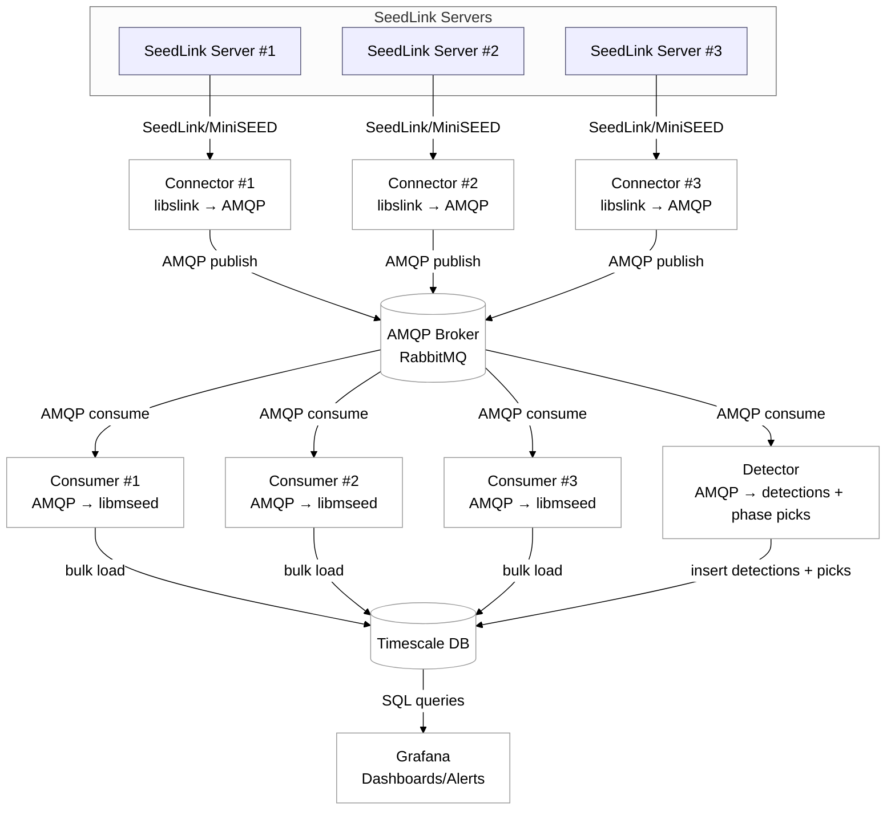

# seisstream

Seisstream streams MiniSEED from SeedLink to RabbitMQ. Consumers parse MiniSEED and write samples to TimescaleDB. The detector reads from AMQP and stores event detections and phase picks. The core pieces are a C connector/consumer and a Python detector.

## Architecture



## Components
- `connector/`: SeedLink client that forwards packets to an AMQP (RabbitMQ) broker.
- `consumer/`: AMQP consumer that parses MiniSEED (libmseed) and bulk-loads samples into TimescaleDB.
- `detector/`: Python detector that consumes MiniSEED from AMQP and writes `event_detections` and `phase_picks` to TimescaleDB.

## Detector
The detector supports two modes:
- `sta_lta`: classic trigger detector, outputs event windows.
- `seisbench`: SeisBench EQTransformer (pretrained model), outputs event windows and phase picks.

Basic usage:
```sh
python -m detector.main --host 127.0.0.1 --exchange stations --pg-host 127.0.0.1
```

## Quick Start (Docker)
Prerequisites: Docker and Docker Compose.

```sh
docker compose up -d rabbitmq timescaledb
docker compose up -d connector consumer grafana
```

Start detector explicitly:
```sh
docker compose up -d detector
```

Detector build note:
- `detector` image build can take significantly longer than `connector`/`consumer` because it installs large Python ML dependencies (`torch` and `cuda` related dependencies) and may download model/runtime wheels.

`streamlist.conf` is user-provided and does not exist in a fresh clone. Create it from the example:
```sh
cp connector/streamlist.conf.example streamlist.conf
```
Then edit `streamlist.conf` to choose stations/selectors. Set `SEEDLINK_HOST` to point at a SeedLink server if you do not want the default.

Grafana is exposed on `localhost:3000` with the default user/password in `docker-compose.yml`.

https://github.com/user-attachments/assets/6d3b54e7-188c-432f-aa9c-4b9c00ab6a9b


## Configuration
The Docker setup uses environment variables with defaults:
- `RABBITMQ_USER`, `RABBITMQ_PASS`
- `PGUSER`, `PGPASSWORD`, `PGDATABASE`
- `AMQP_EXCHANGE`, `AMQP_BINDING_KEY`
- `SEEDLINK_HOST`
- `DETECTOR_MODE`, `DETECTOR_SB_PRETRAINED`
- `GRAFANA_USER`, `GRAFANA_PASSWORD`

Recommended setup:
1. Create your local env file from the template:
   `cp .env.example .env`
2. Put your deployment values there.
3. Start services with `docker compose up -d`.

Template contents (`.env.example`):
```sh
# RabbitMQ
RABBITMQ_USER=guest
RABBITMQ_PASS=guest

# TimescaleDB/PostgreSQL
PGUSER=seis
PGPASSWORD=seis
PGDATABASE=seismic

# AMQP routing
AMQP_EXCHANGE=stations
AMQP_BINDING_KEY=GE.#

# SeedLink source (host:port)
SEEDLINK_HOST=geofon.gfz-potsdam.de:18000

# Detector runtime (Docker Compose detector service)
DETECTOR_MODE=seisbench
DETECTOR_SB_PRETRAINED=original

# Grafana admin
GRAFANA_USER=admin
GRAFANA_PASSWORD=admin
```

Validate the resolved configuration before starting:
```sh
docker compose config
```

## Synthetic Testing
Use the publisher to send synthetic MiniSEED into RabbitMQ. This exercises the consumer and detector without SeedLink.

```sh
python3 tools/publish_mseed/publish_mseed.py --host 127.0.0.1 --exchange stations --event --event-probability 0.1 --event-amplitude 2500 --event-duration 20 --event-frequency 0.6
```

Docker option:
```sh
COMPOSE_PROFILES=tools docker compose run --rm publisher --host rabbitmq --exchange stations --count 3
```


https://github.com/user-attachments/assets/13190d10-a5c8-46b4-be4e-47f160ae5256


## Build
Prerequisites: `libslink`, `librabbitmq`, `libmseed`, `libpq` headers/libs available to the compiler.

```sh
make            # builds connector and consumer into ./build
make connector  # builds only connector
make consumer   # builds only consumer
```

## Detector native run (without Docker)
Use this when running detector directly on your host instead of in Compose.

```sh
cd detector
python3 -m venv .venv
source .venv/bin/activate
python -m pip install --upgrade pip
python -m pip install -r requirements.txt
python -m detector.main --host 127.0.0.1 --exchange stations --pg-host 127.0.0.1 --detector-mode sta_lta
```

For SeisBench mode:
```sh
python -m detector.main --host 127.0.0.1 --exchange stations --pg-host 127.0.0.1 --detector-mode seisbench --sb-pretrained original
```


https://github.com/user-attachments/assets/529487ab-2f16-4b82-bb36-e4a8cd2541a7


## Connector usage (SeedLink → AMQP)
```sh
./build/connector [options] host[:port]
  -V                 report version
  -h                 show help
  -v                 increase verbosity (repeatable)
  -p                 print packet details
  -Ap                prompt for SeedLink user/password
  -At                prompt for SeedLink token
  -nd <secs>         reconnect delay (default 30)
  -nt <secs>         idle timeout (default 600)
  -k <secs>          keepalive interval
  -l <listfile>      stream list file (multi-station)
  -s <selectors>     selectors for all-station/default
  -S <streams>       NET_STA[:selectors], comma-separated
  -x <statefile>     save/restore sequence state
  --amqp-host host   AMQP host (default 127.0.0.1)
  --amqp-port port   AMQP port (default 5672)
  --amqp-user user   AMQP user (default guest)
  --amqp-password pw AMQP password (default guest)
  --amqp-vhost vhost AMQP vhost (default /)
  --amqp-exchange ex AMQP exchange (default empty)
  --amqp-routing-key k AMQP routing key/queue (default binq)
```
## Consumer usage (AMQP → TimescaleDB)
```sh
./build/consumer [opts]
  -h <amqp-host>      (default 127.0.0.1)
  -p <amqp-port>      (default 5672)
  -u <amqp-user>      (default guest)
  -P <amqp-pass>      (default guest)
  -v <amqp-vhost>     (default /)
  -q <queue>          (default binq)
  --prefetch <n>      (default 10)
  --pg-host <host>    (default 192.168.0.106)
  --pg-port <port>    (default 5432)
  --pg-user <user>    (default admin)
  --pg-password <pw>  (default my-secret-pw)
  --pg-db <name>      (default seismic)
```

## Detector usage (AMQP → detections and picks)
```sh
python -m detector.main [opts]
  --host <amqp-host>             (default 127.0.0.1)
  --port <amqp-port>             (default 5672)
  --user <amqp-user>             (default guest)
  --password <amqp-pass>         (default guest)
  --vhost <amqp-vhost>           (default /)
  --exchange <amqp-exchange>     (default stations)
  --queue <queue>                (default empty for exclusive)
  --binding-key <key>            (repeatable, default "#")
  --prefetch <n>                 (default 50)
  --buffer-seconds <secs>        (default 120)
  --detect-every-seconds <secs>  (default 15)
  --pick-filter-seconds <secs>   (default 2)
  --detector-mode <mode>         (sta_lta or seisbench; default sta_lta)
  --sb-pretrained <name>         (default original)
  --sb-threshold-p <value>       (default 0.3)
  --sb-threshold-s <value>       (default 0.3)
  --sb-detection-threshold <v>   (default 0.3)
  --sb-device <cpu|cuda>         (default cpu)
  --log-level <level>            (default INFO)
  --pg-host <host>               (default localhost)
  --pg-port <port>               (default 5432)
  --pg-user <user>               (default seis)
  --pg-password <pw>             (default seis)
  --pg-db <name>                 (default seismic)
```

## Database schema
`db/init/01_schema.sql` defines three TimescaleDB hypertables:
- `seismic_samples`: raw waveform samples.
- `event_detections`: event windows (`ts_on`, `ts_off`).
- `phase_picks`: pick timestamp (`ts`), phase (`P`/`S`).

## Troubleshooting
- Connector exits quickly: verify SeedLink credentials and `SEEDLINK_HOST`.
- Consumer cannot connect: check `PGUSER`, `PGPASSWORD`, and `PGDATABASE`.
- No data in DB: confirm `streamlist.conf`, `AMQP_EXCHANGE`, and `AMQP_BINDING_KEY`.
- Use `docker compose logs -f connector consumer` to inspect runtime errors.

## TODO
- Add unit and functional testing.
- Add a minimal end-to-end test with sample MiniSEED input.
- Document non-Docker local setup steps.
- Add a sample Grafana dashboard screenshot.
