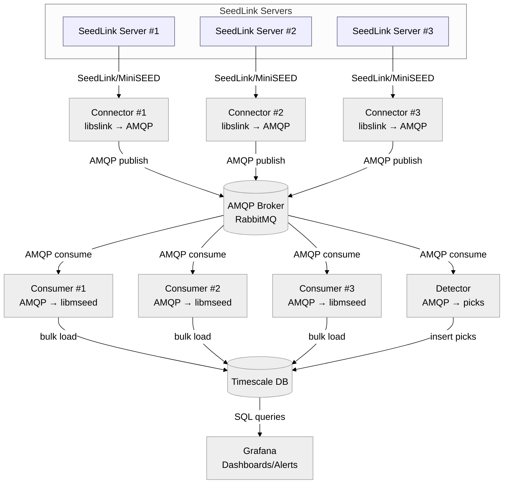

# seisstream

Seisstream streams MiniSEED from SeedLink to RabbitMQ. Consumers parse MiniSEED and write samples to TimescaleDB. The detector reads from AMQP and stores picks. The core pieces are a C connector/consumer and a Python detector.

## Architecture



## Components
- `connector/`: SeedLink client that forwards packets to an AMQP (RabbitMQ) broker.
- `consumer/`: AMQP consumer that parses MiniSEED (libmseed) and bulk-loads samples into TimescaleDB.
- `detector/`: Python STA/LTA detector that consumes MiniSEED from AMQP and inserts picks into TimescaleDB.

## Detector
The detector reads MiniSEED from AMQP, buffers short windows, and runs STA/LTA to find picks. It writes picks to TimescaleDB and can be tuned with buffer, detect interval, and pick filter settings.
Basic usage:
```sh
python -m detector.main --host 127.0.0.1 --exchange stations --pg-host 127.0.0.1
```


## Quick Start (Docker)
Prerequisites: Docker and Docker Compose.

```sh
docker compose up -d rabbitmq timescaledb
docker compose up -d connector consumer grafana
```

Edit `streamlist.conf` to choose stations. Set `SEEDLINK_HOST` to point at a SeedLink server if you do not want the default.

Grafana is exposed on `localhost:3000` with the default user/password in `docker-compose.yml`.

## Configuration
The Docker setup uses environment variables with defaults:
- `RABBITMQ_USER`, `RABBITMQ_PASS`
- `PGUSER`, `PGPASSWORD`, `PGDATABASE`
- `AMQP_EXCHANGE`, `AMQP_BINDING_KEY`
- `SEEDLINK_HOST`
- `GRAFANA_USER`, `GRAFANA_PASSWORD`

## Synthetic Testing
Use the publisher to send synthetic MiniSEED into RabbitMQ. This exercises the consumer and detector without SeedLink.

```sh
python3 tools/publish_mseed/publish_mseed.py --host 127.0.0.1 --exchange stations --event --event-probability 0.1 --event-amplitude 2500 --event-duration 20 --event-frequency 0.6
```

Docker option:
```sh
COMPOSE_PROFILES=tools docker compose run --rm publisher --host rabbitmq --exchange stations --count 3
```


## Build
Prerequisites: `libslink`, `librabbitmq`, `libmseed`, `libpq` headers/libs available to the compiler.

```sh
make            # builds connector and consumer into ./build
make connector  # builds only connector
make consumer   # builds only consumer
```

## Connector usage (SeedLink → AMQP)
```sh
./build/connector [options] host[:port]
  -V                 report version
  -h                 show help
  -v                 increase verbosity (repeatable)
  -p                 print packet details
  -Ap                prompt for SeedLink user/password
  -At                prompt for SeedLink token
  -nd <secs>         reconnect delay (default 30)
  -nt <secs>         idle timeout (default 600)
  -k <secs>          keepalive interval
  -l <listfile>      stream list file (multi-station)
  -s <selectors>     selectors for all-station/default
  -S <streams>       NET_STA[:selectors], comma-separated
  -x <statefile>     save/restore sequence state
  --amqp-host host   AMQP host (default 127.0.0.1)
  --amqp-port port   AMQP port (default 5672)
  --amqp-user user   AMQP user (default guest)
  --amqp-password pw AMQP password (default guest)
  --amqp-vhost vhost AMQP vhost (default /)
  --amqp-exchange ex AMQP exchange (default empty)
  --amqp-routing-key k AMQP routing key/queue (default binq)
```
## Consumer usage (AMQP → TimescaleDB)
```sh
./build/consumer [opts]
  -h <amqp-host>      (default 127.0.0.1)
  -p <amqp-port>      (default 5672)
  -u <amqp-user>      (default guest)
  -P <amqp-pass>      (default guest)
  -v <amqp-vhost>     (default /)
  -q <queue>          (default binq)
  --prefetch <n>      (default 10)
  --pg-host <host>    (default 192.168.0.106)
  --pg-port <port>    (default 5432)
  --pg-user <user>    (default admin)
  --pg-password <pw>  (default my-secret-pw)
  --pg-db <name>      (default seismic)
```
Note: libmseed parsing runs in verbose mode by default.

## Detector usage (AMQP → picks)
```sh
python -m detector.main [opts]
  --host <amqp-host>             (default 127.0.0.1)
  --port <amqp-port>             (default 5672)
  --user <amqp-user>             (default guest)
  --password <amqp-pass>         (default guest)
  --vhost <amqp-vhost>           (default /)
  --exchange <amqp-exchange>     (default stations)
  --queue <queue>                (default empty for exclusive)
  --binding-key <key>            (repeatable, default "#")
  --prefetch <n>                 (default 50)
  --buffer-seconds <secs>        (default 120)
  --detect-every-seconds <secs>  (default 15)
  --pick-filter-seconds <secs>   (default 2)
  --log-level <level>            (default INFO)
  --pg-host <host>               (default localhost)
  --pg-port <port>               (default 5432)
  --pg-user <user>               (default seis)
  --pg-password <pw>             (default seis)
  --pg-db <name>                 (default seismic)
```

## Database schema
`db/init/01_schema.sql` defines TimescaleDB hypertables for `seismic_samples` and `picks` with indexes and a unique constraint on picks.

## Troubleshooting
- Connector exits quickly: verify SeedLink credentials and `SEEDLINK_HOST`.
- Consumer cannot connect: check `PGUSER`, `PGPASSWORD`, and `PGDATABASE`.
- No data in DB: confirm `streamlist.conf`, `AMQP_EXCHANGE`, and `AMQP_BINDING_KEY`.
- Use `docker compose logs -f connector consumer` to inspect runtime errors.

## TODO
- Add unit and functional testing.
- Add a minimal end-to-end test with sample MiniSEED input.
- Document non-Docker local setup steps.
- Add a sample Grafana dashboard screenshot.
- Integrate EQTransformer-based picks into the detector pipeline.
